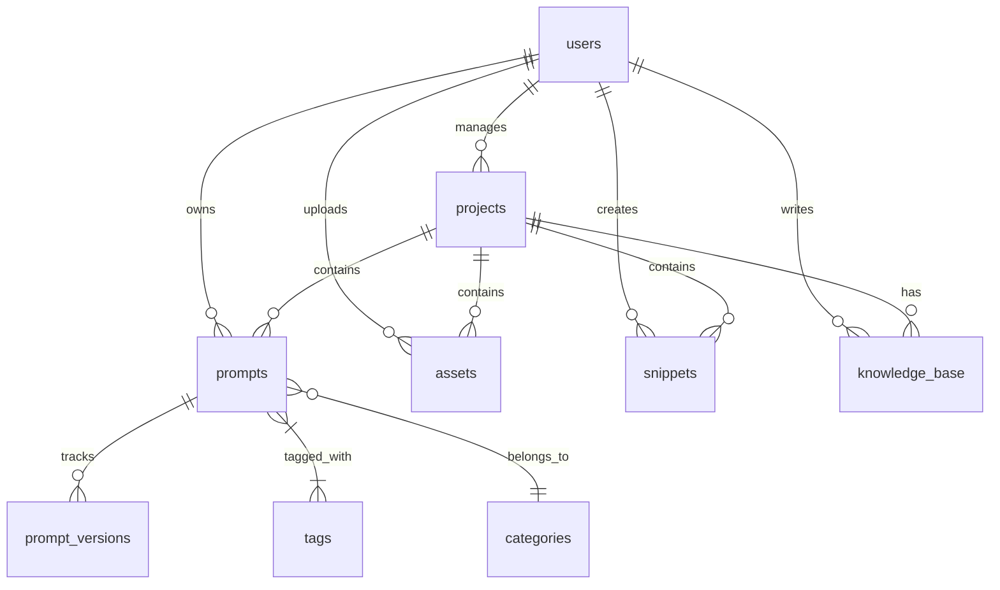

# Database Design: PromptHub

Dokumen ini memuat rancangan detail struktur *database* untuk aplikasi PromptHub. Basis data dirancang menggunakan paradigma relasional (RDBMS) yang dioptimalkan untuk performa tinggi dan kompatibel dengan PostgreSQL.

---

## 1. Entity Relationship Diagram (ERD)

---

## 2. Struktur Tabel & Kolom

### Tabel: `users`
Menyimpan data otentikasi dan profil admin/pengguna.
| Column | Type | PK/FK | Constraint | Keterangan |
|---|---|---|---|---|
| `id` | UUID | **PK** | NOT NULL | Identifier unik |
| `email` | VARCHAR(255) | - | UNIQUE, NOT NULL | Digunakan untuk login |
| `password_hash` | VARCHAR(255) | - | NOT NULL | Hasil hashing bcrypt |
| `role` | VARCHAR(50) | - | DEFAULT 'Admin' | RBAC untuk masa depan |
| `created_at` | TIMESTAMP | - | DEFAULT NOW() | - |
| `updated_at` | TIMESTAMP | - | - | Auto update on edit |

### Tabel: `projects`
Menyimpan manajemen proyek dan statusnya.
| Column | Type | PK/FK | Constraint | Keterangan |
|---|---|---|---|---|
| `id` | UUID | **PK** | NOT NULL | Identifier unik |
| `user_id` | UUID | **FK** | NOT NULL | Relasi ke `users(id)` |
| `name` | VARCHAR(255) | - | NOT NULL | Nama proyek |
| `description` | TEXT | - | NULL | Deskripsi opsional |
| `status` | VARCHAR(50) | - | DEFAULT 'Active' | Active, Completed, Paused |
| `progress` | INT | - | DEFAULT 0 | Persentase (0-100) |
| `framework` | VARCHAR(100) | - | NULL | Misal: React, Laravel |
| `deadline` | DATE | - | NULL | Tenggat waktu |
| `is_trashed` | BOOLEAN | - | DEFAULT FALSE | Soft delete flag |
| `created_at` | TIMESTAMP | - | DEFAULT NOW() | - |

### Tabel: `prompts`
Entitas utama untuk menyimpan prompt AI.
| Column | Type | PK/FK | Constraint | Keterangan |
|---|---|---|---|---|
| `id` | UUID | **PK** | NOT NULL | - |
| `user_id` | UUID | **FK** | NOT NULL | Relasi ke `users(id)` |
| `project_id` | UUID | **FK** | NULL | Relasi ke `projects(id)` |
| `category_id` | UUID | **FK** | NULL | Relasi ke `categories(id)` |
| `title` | VARCHAR(255) | - | NOT NULL | Judul Prompt |
| `content` | TEXT | - | NOT NULL | Isi Prompt utama |
| `ai_provider`| VARCHAR(100) | - | NULL | ChatGPT, Claude, dll |
| `is_favorite`| BOOLEAN | - | DEFAULT FALSE | Bookmark flag |
| `is_trashed` | BOOLEAN | - | DEFAULT FALSE | Soft delete flag |
| `created_at` | TIMESTAMP | - | DEFAULT NOW() | - |

### Tabel: `prompt_versions`
Melacak riwayat perubahan pada Prompt (Version History).
| Column | Type | PK/FK | Constraint | Keterangan |
|---|---|---|---|---|
| `id` | UUID | **PK** | NOT NULL | - |
| `prompt_id` | UUID | **FK** | NOT NULL | Relasi ke `prompts(id) ON DELETE CASCADE` |
| `content` | TEXT | - | NOT NULL | Isi Prompt pada versi ini |
| `version_note`| VARCHAR(255) | - | NULL | Catatan revisi |
| `created_at` | TIMESTAMP | - | DEFAULT NOW() | Immutable record |

### Tabel: `tags` & `prompt_tags` (Many-to-Many)
**Tabel `tags`**
| Column | Type | PK/FK | Constraint |
|---|---|---|---|
| `id` | UUID | **PK** | NOT NULL |
| `name` | VARCHAR(50) | - | UNIQUE, NOT NULL |

**Tabel `prompt_tags`** (Pivot Table)
| Column | Type | PK/FK | Constraint |
|---|---|---|---|
| `prompt_id` | UUID | **PK/FK** | `prompts(id) CASCADE` |
| `tag_id` | UUID | **PK/FK** | `tags(id) CASCADE` |

### Tabel Pendukung (`assets`, `snippets`, `knowledge_base`)
Ketiga tabel ini memiliki pola struktur yang identik. Mereka memiliki `id (PK)`, `user_id (FK)`, `project_id (FK, Nullable)`, `title/name`, `content/file_url`, `type`, dan `created_at`.

---

## 3. Relationships (Relasi Antar Entitas)
- **One-to-Many (1:N):**
  - `users` ➔ `projects`, `prompts`, `assets`, dll. (1 User punya banyak Project).
  - `projects` ➔ `prompts`, `assets`, `snippets`. (1 Project mewadahi banyak elemen).
  - `prompts` ➔ `prompt_versions`. (1 Prompt punya banyak riwayat versi).
- **Many-to-Many (M:N):**
  - `prompts` ↔ `tags` (1 Prompt bisa punya banyak Tag, 1 Tag bisa nempel di banyak Prompt). Dihubungkan lewat pivot `prompt_tags`.

---

## 4. Constraint & Integritas Data
- **Soft Delete:** Data pada `prompts` dan `projects` tidak langsung di-`DELETE` dari *database*, melainkan menggunakan constraint logika `is_trashed = true`.
- **Referential Integrity (Cascade):**
  - Menghapus sebuah `prompt` secara permanen akan otomatis menghapus (CASCADE) semua riwayat di `prompt_versions` dan tautan di `prompt_tags`.
  - Menghapus `project` **TIDAK** menghapus `prompt` (hanya men-set `project_id = NULL` menggunakan aksi `SET NULL`).

---

## 5. Optimasi Query & Indexing Strategy
Agar pencarian dan penyaringan data (*Global Search*) sangat cepat meskipun data mencapai puluhan ribu, index (B-Tree) berikut akan diterapkan:
1. `INDEX idx_prompts_user_id ON prompts(user_id)` (Mempercepat filter milik user aktif).
2. `INDEX idx_prompts_project_id ON prompts(project_id)` (Mempercepat loading saat membuka sebuah project).
3. `INDEX idx_trashed ON prompts(is_trashed)` (Mempercepat filter "Tampilkan yang tidak di trash").
4. **Full-Text Search (FTS):** Menggunakan fitur *FTS* PostgreSQL (seperti `tsvector`) pada kolom `prompts.title`, `prompts.content`, dan `projects.name` agar pencarian kata kunci sangat cepat tanpa menggunakan `LIKE '%keyword%'` yang memberatkan CPU.

---

## 6. Future Scalability (Skalabilitas di Masa Depan)
- **Multi-Tenant (SaaS Ready):** Karena semua tabel sudah memiliki kolom `user_id`, jika ingin diubah menjadi SaaS untuk ribuan pengguna (*Multi-User*), kita bisa langsung menerapkan **Row-Level Security (RLS)** pada PostgreSQL via Supabase, sehingga User A mustahil melihat data User B.
- **Team Workspace:** Kelak bisa ditambahkan tabel `workspaces` dan `workspace_members` yang menjadi jembatan antara `users` dan entitas, menggantikan peran langsung `user_id`.
- **Database Partitioning:** Jika tabel `prompt_versions` membengkak di masa depan, PostgreSQL mendukung *table partitioning* berdasarkan rentang tanggal (`created_at`) untuk menjaga performa baca/tulis tetap konsisten.
